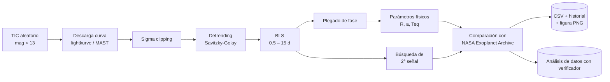

<div align="center">

# Detector de Exoplanetas con datos de TESS

**Un pipeline en Python que busca tránsitos planetarios en curvas de luz públicas de la NASA, usando solo software libre.**


</div>

---

## ¿De qué trata?

Misiones como **TESS** entregan curvas de luz de una cantidad enorme de estrellas, pero la mayoría está sin revisar en detalle. Este proyecto reproduce, a pequeña escala y en una computadora personal, el tipo de limpieza y búsqueda que hacen las grandes agencias espaciales:

> **¿Es posible diseñar una aplicación de Python que integre fotometría de tránsitos y espectroscopía (velocidad radial) para detectar y estudiar exoplanetas usando datos de acceso público?**

El resultado son tres cuadernos de Jupyter que van de lo didáctico a lo automatizado:

| # | Cuaderno | Qué hace |
|---|----------|----------|
| 1 | `01_MuestraFunc.ipynb` | **Muestra teórica.** Simula un sistema planetario (tránsito + velocidad radial) y valida el método con un caso real: **WASP-39 b**. |
| 2 | `02_DetectorAutomatizado.ipynb` | **Detector automático.** Elige estrellas aleatorias del TESS Input Catalog, las analiza una por una (o en bucle continuo) y guarda todo en CSV. |
| 3 | `03_ValidacionCandidatos.ipynb` | **Validación.** Revisa los candidatos con pruebas anti-falsos positivos (par/impar, eclipse secundario, resonancias). Con este sistema se confirmo **HD 202269A** y **Gaia DR3 1976698813270381952** |

---

## Cómo funciona el pipeline



1. **Selección** – TIC aleatorio con magnitud < 13 que no esté en el historial.
2. **Descarga** – curva de luz TESS con `lightkurve`, con autorreparación de archivos FITS corruptos.
3. **Limpieza** – *sigma clipping* para quitar valores atípicos sin borrar el tránsito.
4. **Detrending** – filtro Savitzky-Golay para eliminar tendencias lentas (manchas, instrumento).
5. **Búsqueda de período** – *Box Least Squares* (`astropy`) sobre miles de períodos de prueba.
6. **Plegado de fase** – superpone todos los tránsitos con mediana binada.
7. **Segunda señal** – enmascara el tránsito principal y repite BLS (indicio de multiplanetario).
8. **Parámetros físicos** – radio planetario, semieje mayor (3.ª ley de Kepler) y temperatura de equilibrio.
9. **Contraste** – consulta TAP al NASA Exoplanet Archive y calcula el error relativo del período.
10. **Registro** – fila en CSV, historial anti-repetición y figura de 4 paneles por estrella.

### Las matemáticas detrás

| Magnitud | Relación usada |
|---|---|
| Profundidad del tránsito | `δ ≈ (r / R)²` → `r ≈ R · √δ` |
| Semieje mayor | `a³ ≈ G·M·P² / (4π²)` |
| Temperatura de equilibrio | balance radiativo con albedo 0.3 y redistribución uniforme |
| Velocidad radial | modelo circular con semiamplitud `K` |

---

## Resultados

### 1. Datos simulados

Con un sistema simulado de período **3.52 d** (incluye oscurecimiento de borde), BLS recuperó **3.5195 d** → error relativo de **0.014 %**.

<p align="center">
  <br>
  
</p>

La simulación también genera 40 observaciones espectroscópicas sintéticas irregulares y recupera la semiamplitud de velocidad radial impuesta:

<p align="center"></p>

### 2. Caso real de validación: WASP-39 b (TIC 181949561)

| Parámetro | Este proyecto | Valor publicado | Comentario |
|---|---|---|---|
| Período orbital | **4.05476 d** | 4.055294 d | error **0.0132 %** |
| Semieje mayor | 0.0486 UA | — | por 3.ª ley de Kepler |
| Radio planetario | 0.882 R | 1.270 R | diferencia notable |
| Temperatura de equilibrio | 1022 K | — | estimación del modelo |
| Densidad (radio + RV) | 0.506 g/cm³ | 0.09 g/cm³ | el modelo simple no capta el inflado |

<p align="center">
  <br>
  
</p>

**Lectura:** el **período** es la salida más robusta del pipeline; el radio, la densidad y la temperatura dependen de más supuestos (radio estelar, modelo de tránsito, albedo) y acumulan más error.

### 3. Muestra de seis sistemas conocidos

| Estrella | Período aprox. | Tipo de planeta | Motivo de inclusión |
|---|---|---|---|
| WASP-39 | ~4.06 d | Gigante gaseoso | Caso de validación JWST |
| WASP-18 | ~0.94 d | Gigante gaseoso caliente | Período extremo |
| HAT-P-7 | ~2.20 d | Gigante gaseoso | Tránsito profundo, alta S/N |
| TOI-132 | ~2.11 d | Neptuno caliente | Candidato TESS reciente |
| LTT 9779 | ~0.79 d | Neptuno ultra caliente | Período extremadamente corto |
| WASP-121 | ~1.27 d | Júpiter hinchado | Tránsito profundo |

Los períodos se recuperaron con errores relativos **< 1 %** en casi toda la muestra. Aprendizajes por caso: WASP-18 obligó a reducir la ventana de detrending; LTT 9779 pidió más frecuencias de prueba en períodos cortos; TOI-132 sirvió para probar la consulta automática al archivo.

### 4. Búsqueda automática sobre el TESS Input Catalog

| Métrica | Valor |
|---|---|
| Registros procesados | **7 178** |
| Estado `ANALIZADO` | 6 887 |
| Sin curva TESS | 170 |
| Con error | 121 |
| Marcados con anomalía en la luz | 135 |
| Posibles binarias eclipsantes | 1 067 |
| Con posible segunda señal | 3 |
| Posible tránsito | 1 |

<p align="center"></p>

> Estas categorías son **banderas heurísticas del algoritmo**, no clasificaciones confirmadas.

### 5. Casos individuales marcados como posible binaria eclipsante

Cuatro estrellas se inspeccionaron a mano y mostraron comportamientos muy distintos, lo que demuestra que **un SNR alto no basta para clasificar una señal**:

| Estrella | TIC | Período BLS | SNR | Qué muestra la curva |
|---|---|---|---|---|
| HD 202269A | 79303604 | 6.1849 d | 13.24 | Evento asimétrico: subida abrupta y decaimiento lento. Binaria confirmada |
| TIC 161313268 | 161313268 | 1.1260 d | 15.33 | Mucha dispersión, plegada sin caída definida |
| Gaia DR3 1976698813270381952 | 430433607 | 1.3025 d | 8.14 | Modulación de ~30 % con mínimos repetidos → **compatible con binaria cercana** (el período BLS es ~3× el intervalo entre mínimos). Confirmado como binaria |
| TIC 953416511 | 953416511 | 0.5218 d | 2.18×10¹⁸ | Un único valor extremo (~10²⁰) domina todo → **artefacto de datos** |

<p align="center">
  
  <br>
  
  
</p>

---

## Etapa de validación de candidatos

`03_ValidacionCandidatos.ipynb` toma el CSV del detector y revisa cada `posible_transito` / `posible_segunda_senal`:

| Prueba | Qué detecta | Columna de salida |
|---|---|---|
| Tránsitos par/impar | Binarias (profundidades distintas alternadas) | `diferencia_par_impar_pct` |
| Eclipse secundario (fase 0.5) | Otra firma típica de binarias | `profundidad_eclipse_secundario` |
| Resonancia entre señales | Relación simple entre dos períodos | `resonancia_con_otra_senal` |
| NASA Exoplanet Archive | Si ya existe un planeta catalogado | `disposicion_archive` |

Descarga **todos los sectores TESS** disponibles, genera una figura de 4 paneles y guarda tu veredicto manual (`candidato fuerte`, `probable falso positivo`, `necesita mas datos`, `redescubrimiento conocido`) en `candidatos_validados.csv`, retomable en cualquier momento.

---

## Instalación y uso

```bash
git clone https://github.com/<tu-usuario>/exoplanet-transit-detector.git
cd exoplanet-transit-detector

python -m venv .venv
source .venv/bin/activate        # En Windows: .venv\Scripts\activate
pip install -r requirements.txt

jupyter notebook
```

Luego abre los cuadernos en orden:

1. **`01_MuestraFunc`** – ejecútalo de arriba abajo para ver la simulación y el caso WASP-39 b.
2. **`02_DetectorAutomatizado`** – ajusta la sección **B. Configuración** y pulsa **ANALIZAR UNA ESTRELLA**, o ejecuta la última celda para el **modo automático continuo** (detenlo con *Kernel → Interrupt*).
3. **`03_ValidacionCandidatos`** – revisa los candidatos pendientes uno por uno.

> **Antes de ejecutar:** cambia `CARPETA_SALIDA` en la celda de configuración (en los cuadernos 2 y 3 apunta a una ruta de la computadora del autor). Se necesita conexión a internet para consultar MAST y el NASA Exoplanet Archive.

### Parámetros principales (cuaderno 2)

| Parámetro | Valor por defecto | Descripción |
|---|---|---|
| `MAG_MAX` | `13.0` | Magnitud aparente máxima de las estrellas elegidas |
| `PERIODO_MIN_DIAS` / `PERIODO_MAX_DIAS` | `0.5` / `15.0` | Rango de búsqueda de BLS |
| `PAUSA_ENTRE_ESTRELLAS` | `5` | Segundos de pausa en el modo continuo |

### Funciones principales

| Función | Rol |
|---|---|
| `limpiar_cache_lightkurve_corrupta()` | Borra FITS corruptos por descargas interrumpidas |
| `elegir_tic_aleatorio(historial)` | TIC aleatorio que no esté ya analizado |
| `descargar_y_limpiar_curva(tic)` | Descarga + sigma clipping |
| `aplicar_detrending(curva)` | Savitzky-Golay |
| `buscar_periodo_bls(curva)` | Período, profundidad, duración, potencia |
| `buscar_segunda_senal(curva, periodo)` | BLS sobre la curva enmascarada |
| `calcular_parametros_fisicos(...)` | Radio, semieje mayor, Teq |
| `consultar_nasa_exoplanet_archive(tic)` | Parámetros publicados y error relativo |
| `generar_figura_resumen(...)` | Figura de 4 paneles → PNG |
| `procesar_una_estrella(tic)` | Orquesta todo y actualiza CSV + historial |
| `modo_automatico_continuo()` | Bucle sin supervisión |

*(Los nombres corresponden al diseño descrito en el informe; consulta el cuaderno para la firma exacta de cada función.)*

---

## Robustez y reproducibilidad

- **Historial en CSV**: nunca se repite un TIC y se puede interrumpir y continuar (sobrevivió a cortes de internet y de luz durante las corridas).
- **Manejo de errores**: si una estrella falla, el programa registra el error y sigue con la siguiente.
- **Caché saneada**: detecta y borra archivos FITS corruptos y reintenta la descarga.
- **Memoria controlada**: se libera la figura de cada estrella para que sesiones largas no agoten la RAM.
- **Todo abierto**: solo software libre y datos públicos (MAST, NASA Exoplanet Archive).

## Limitaciones

- BLS usa un modelo de caja, no un modelo físico completo del tránsito.
- Los parámetros derivados (radio, densidad, Teq) dependen de supuestos y de catálogos estelares.
- El rango de 0.5–15 d favorece períodos cortos y puede seleccionar armónicos (P/2, 2P…).
- Algunos registros muestran valores numéricos no físicos; hace falta filtrar por límites físicos y valores no finitos.
- Limitaciones de RAM impidieron incorporar análisis atmosférico.

## Referencias y datos

- Kovács, Zucker & Mazeh (2002). *A box-fitting algorithm in the search for periodic transits.* A&A 391, 369.
- Mayor & Queloz (1995). *A Jupiter-mass companion to a solar-type star.* Nature 378, 355.
- MAST – Mikulski Archive for Space Telescopes
- NASA Exoplanet Archive
- Lightkurve · Astropy · Astroquery

El informe completo (marco teórico, metodología, resultados, discusión, glosario y bibliografía) está en `docs/informe_completo.docx`.

## Autor

**Gael melgarejo** — Proyecto Muescientec · 2026
